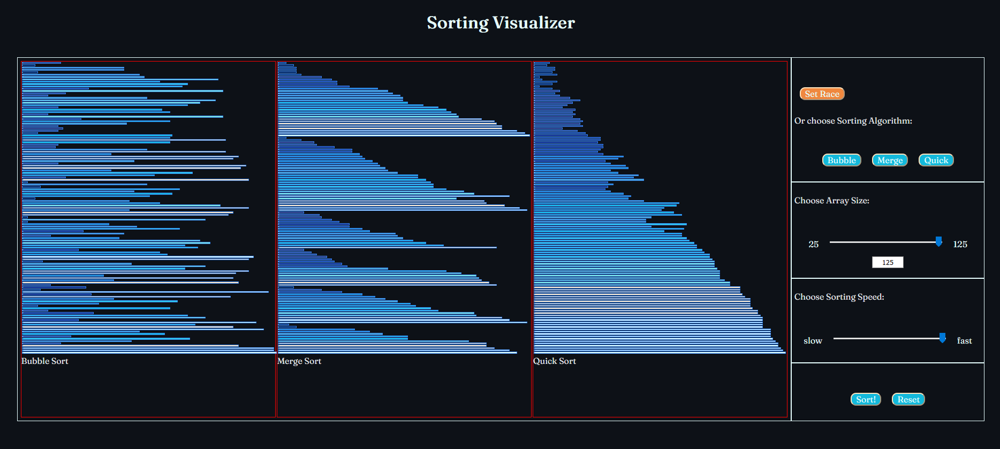
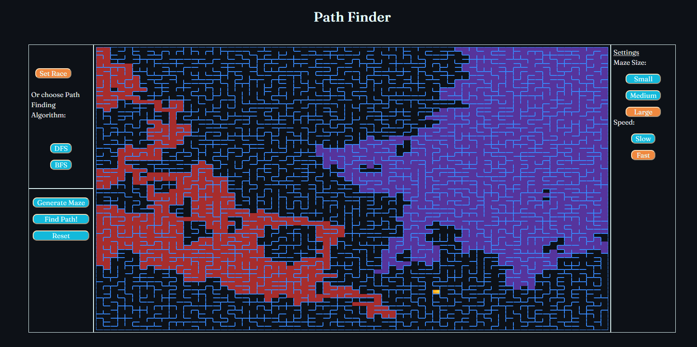

# Visualize CS

Visualize CS is a Front-End library dedicated for visualizing and implementing some of the better known Computer Science algorithms, for sorting and path finding.
[Go to the Site](https://guy-davidson.github.io/VisualizeCS/)

## Sorting Visualizer

Choose a sorting algorithm: Bubble, Merge or Quick, the array size, and sorting speed, and see the sorting in action! Use **Set Race** to watch the algorithms compete who's faster.

## Path Finder

In this module the user can generate a maze, which is implemented as a graph with a Union-Find data structure to create a anywhere-to-anywhere passage. The maze has golden prize, and the DFS/BFS search algorithms are trying to get to it, each in his own unique way.

## Contact
If you would like to get in touch with me or comment on anything I've presented in my site, please fill free to send me a Message via the one of these links. Thanks!

Gmail: guydav12@gmail.com  
or
[linkedin](https://www.linkedin.com/in/guy-davidson/)
